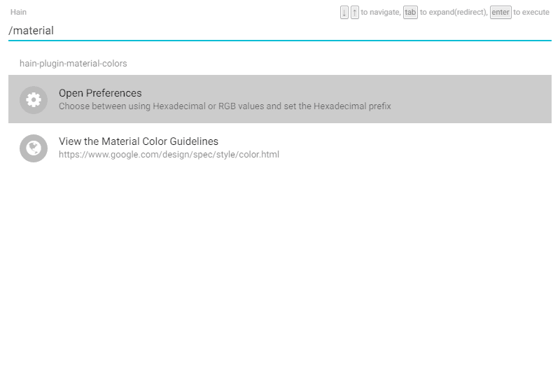

# hain-plugin-material-colors
A [Hain](https://github.com/appetizermonster/hain) plugin for finding and copying colors from the Material Design color palette.



## Install

- To install, run this command in the Hain input text area:

```
/hpm install hain-plugin-material-colors
```
- And then reload the plugins:

```
/hain reload
```

## Usage

```
/material [hue] [shade]
```

## Preferences
To change the settings for the plugin, go to the Hain preferences by typing in `/preferences`.
The given options are:
- Use RGB instead of Hexadecimal
  - The color values used will be in RGB format if enabled.
- Hexadecimal Prefix
  - The prefix used with the hexadecimal color format (# or 0x). The prefix for RGB is rgb.

## Issues
- To display the color thumbnails, you must be connected to the internet as the color images are being retrieved from `http://www.beautycolorcode.com`. I will try to find a workaround for this, or will wait for an update to the Hain API that offers better functionality.

## LICENSE

[MIT License](LICENSE)
